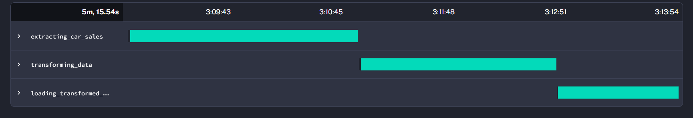
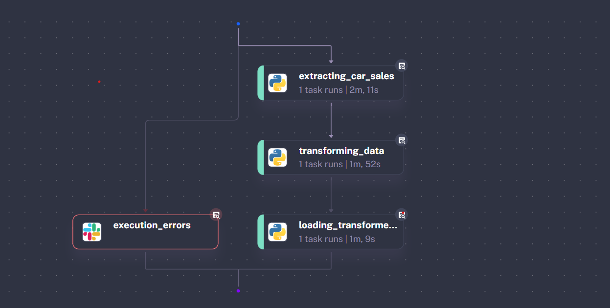
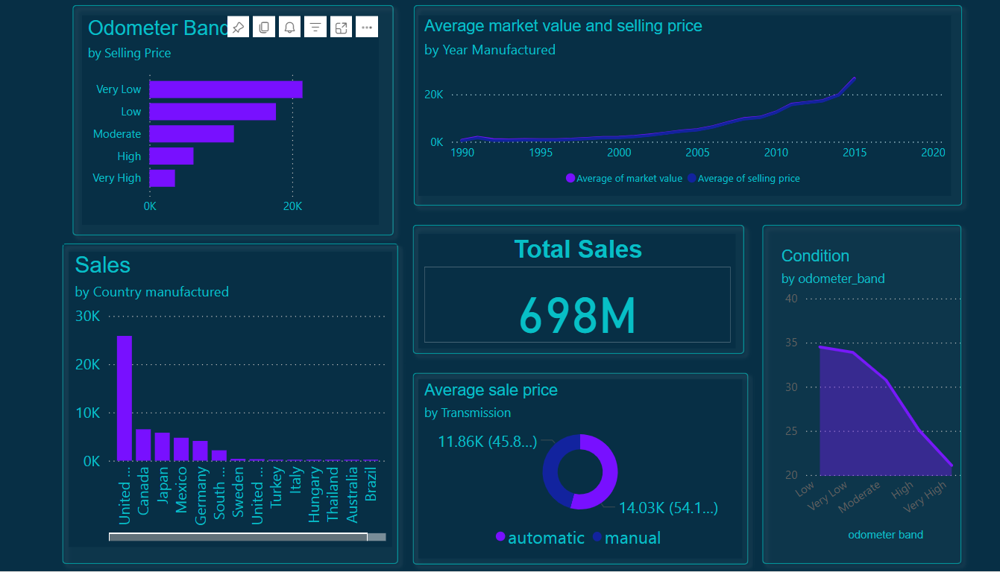

# 🚗 Car Sales Data Analysis Project

This project provides an automated pipeline for extracting, transforming, and loading (ETL) vehicle sales data into a PostgreSQL database using **Kestra workflows**. The processed data is then visualized through a **Power BI dashboard**.

## 🐳 Docker Setup: PostgreSQL and Kestra Orchestration Engine

The project uses Docker Compose to set up:

- `postgres-db`: PostgreSQL database to store the vehicle sales data.
- `kestra`: Workflow orchestration tool for managing ETL processes.

### Starting the Services:

cd docker-compose/
docker-compose up -d

PostgreSQL: localhost:5433

Kestra UI: http://localhost:8080/

## ⚙️ ETL Pipeline Workflow (Kestra)

The ETL workflow is defined in:

etl-pipeline/car_sales_etl.yaml

## Workflow steps

### Extraction

Downloads the car sales dataset from Kaggle using the Kaggle API.

Extracts the CSV from a ZIP archive.

Saves the data as car_prices.csv.

### Transformation

Cleans and preprocesses the data:

Renames columns for consistency.

Converts state abbreviations to full names.

Extracts manufacturing country from the VIN.

Categorizes odometer readings.

Filters out suspicious pricing data.

Randomly samples 50,000 rows.

### Loading

Connects to the PostgreSQL DB.

Creates the car_sales table if it doesn't exist.

Bulk inserts the cleaned dataset into the DB.

### Gantt chart of the complete ETL process

### Error Notifications

Sends Slack alert if workflow fails (requires secret: SLACK_WEBHOOK).

### 🧪 Kestra Pipeline Overview

## 📊 Power BI Dashboard

The interactive Power BI report (Car_Sales_Analysis.pbix) visualizes key insights:

Open the .pbix file with Power BI Desktop from the dashboard/ folder.

## 📌 How to run the full workflow

## Start Docker services:

docker-compose -f docker-compose/docker-compose.yaml up -d

Access Kestra at:

➡️ http://localhost:8080/

### Upload and trigger the ETL pipeline:

Upload car_sales_etl.yaml via Kestra UI.

Start the workflow to process and load the data.

### Open Power BI Dashboard:

Open dashboard/car_sales_analysis.pbix with Power BI Desktop.

## 🛠️ Requirements / Dependencies

-Docker & Docker Compose.

-Kestra (runs via Docker).

-Power BI Desktop.

-Python packages (handled inside YAML):

pandas, numpy, requests, us, vininfo, psycopg2-binary.

## 📢 Error Handling and Notifications

ETL workflow failures trigger a Slack alert using SLACK_WEBHOOK in your secrets.

## 👏 Contributing & License

Open for improvements and learning purposes.

Feel free to fork, raise issues, or suggest enhancements.
